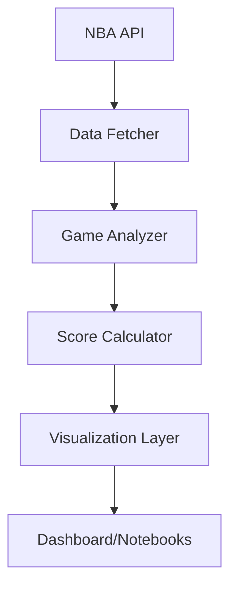

# NBA Game Analysis Dashboard

An interactive dashboard for analyzing and visualizing NBA games based on various quality metrics. The dashboard uses the NBA API to fetch game data, calculates scores for different components, and displays the results in a modern, interactive web application.


## Table of Contents

- [Overview](#overview)
- [Project Structure](#project-structure)
- [Installation](#installation)
- [Usage](#usage)
- [Visualization Features](#visualization-features)
- [Jupyter Notebook Analysis](#jupyter-notebook-analysis)
- [Technologies](#technologies)
- [API Usage](#api-usage)
- [Customizable Parameters](#customizable-parameters)
- [Development](#development)
- [License](#license)

## Overview

The NBA Game Analysis Dashboard is a tool for evaluating the quality of NBA games based on several factors:

- **Period Scores**: How close each period was (closer scores yield higher points)
- **Extra Periods**: Presence of overtime (more overtime periods yield higher points)
- **Lead Changes**: Number of times the lead changed teams (more changes yield higher points)
- **Buzzer Beaters**: Game-deciding shots in the final seconds (more yield higher points)
- **3-Point Percentage**: Average 3-point percentage (higher percentage yields higher points)
- **Star Performances**: Exceptional individual performances (more yield higher points)
- **Margin**: Final score difference (closer games yield higher points)

Based on these factors, each game receives a total score and a grade (A+, A, B+, B, C+, C, D).

## Project Structure

The project is organized in a modular structure to improve readability and maintainability:

```
nba-game-analysis/
│
├── notebooks/                  # Jupyter notebooks for analysis
│   ├── NBA_Game_Analysis.ipynb # Interactive analysis notebook
│
├── src/                        # Source code
│   ├── data/                   # Data fetching and processing
│   │   ├── __init__.py
│   │   └── data_fetcher.py     # Functions for fetching data from the NBA API
│   │
│   ├── utils/                  # Utility functions
│   │   ├── __init__.py
│   │   ├── config.py           # Configuration parameters
│   │   ├── scoring_functions.py # Functions for calculating scores
│   │   └── game_analyzer.py    # Functions for analyzing games
│   │
│   ├── visualization/          # Visualization functions
│   │   ├── __init__.py
│   │   └── visualizations.py   # Enhanced visualization functions
│   │
│   ├── __init__.py
│   └── dashboard.py            # Main file for the Dash application
│
├── requirements.txt            # Package dependencies
└── README.md                   # Project documentation
```

## Installation

1. Clone this repository:
   ```
   git clone https://github.com/yourusername/nba-game-analysis.git
   cd nba-game-analysis
   ```

2. Install dependencies:
   ```
   pip install -r requirements.txt
   ```

## Usage

### Starting the Dashboard

To start the interactive dashboard, run:

```python
python -m src.dashboard
```

The dashboard will be available at http://127.0.0.1:8050/ in your browser.

### Using Jupyter Notebooks

For quick data analysis without starting the server:

```bash
jupyter notebook notebooks/NBA_Game_Analysis.ipynb
```

The notebook provides an interactive environment for:
- Analyzing game data
- Creating custom visualizations
- Filtering and exploring results
- Exporting data for further analysis

## Visualization Features

The project includes several enhanced visualization features:

### 1. Radar Chart with Logarithmic Scale
- Improved visibility of score components using log10(x+1) scaling
- Original values displayed in hover tooltips
- Separate views for individual games and averages

### 2. Enhanced Scatter Plot
- Increased marker sizes for better visibility
- Interactive tooltips with detailed game information
- Color coding by game grade

### 3. Interactive Data Table
- Color-coded grades
- Sortable columns
- Formatted numeric values
- Easy data export functionality

## Jupyter Notebook Analysis

The project includes two ways to analyze data using Jupyter Notebooks:

### Interactive Analysis (NBA_Game_Analysis.ipynb)
- Full access to all visualization functions
- Custom analysis capabilities
- Example analyses and visualizations 
- Step-by-step tutorials
- Pre-configured visualizations
- Easy filtering and sorting
- Data export functionality

## Technologies

The project uses the following technologies:

- **Python**: Main programming language
- **NBA API**: For fetching game data from the NBA
- **Pandas**: For data manipulation and analysis
- **Plotly**: For interactive visualizations
- **Dash**: For creating the interactive web application
- **Jupyter Notebook**: For interactive data analysis and demonstration

## API Usage

The project uses the NBA API to fetch game data. Specifically, the following endpoints are used:

- `leaguegamefinder`: For fetching basic information about games
- `playbyplay`: For fetching detailed play-by-play data for each game
- `boxscoretraditionalv2`: For fetching player statistics for each game

Data is fetched using the functions in `src/data/data_fetcher.py`. To avoid overloading the API, a short delay is inserted between calls.

## Customizable Parameters

You can customize various aspects of the dashboard by changing the parameters in `src/utils/config.py`:

### Weight Parameters

```python
WEIGHT_CONFIG = {
    'period_weights': {1: 0.33, 2: 0.33, 3: 0.34, 4: 0},  # Weights for each period
    'extra_period_weight': 0.05,      # Weight for overtime periods
    'lead_change_weight': 0.05,       # Weight for lead changes
    'buzzer_beater_weight': 0.0,      # Weight for buzzer-beaters
    'fg3_pct_weight': 0.05,           # Weight for 3-point percentage
    'star_performance_weight': 0.1,   # Weight for star performances
    'margin_weight': 0.25,            # Weight for final margin
    'max_total_score': 0.50           # Maximum score for periods
}
```

### Color Scheme

```python
COLORS = {
    'background': '#121212',  # Darker black for background
    'card': '#1E1E1E',        # Slightly lighter black for cards/panels
    'text': '#FFFFFF',        # White text
    'primary': '#BB86FC',     # Purple as primary color
    'secondary': '#03DAC6',   # Teal as secondary color
    'accent': '#CF6679',      # Pink/red as accent color
    'grid': '#333333'         # Dark gray for grid lines
}
```

### Grade Colors

```python
GRADE_COLORS = {
    'A+': '#BB86FC',  # Primary color (purple)
    'A': '#9D65F9',   # Lighter purple
    'B+': '#03DAC6',  # Secondary color (teal)
    'B': '#00B5A3',   # Darker teal
    'C+': '#CF6679',  # Accent color (pink/red)
    'C': '#B04759',   # Darker pink/red
    'D': '#FF7597',   # Lighter pink
    'N/A': '#666666'  # Gray for N/A
}
```

### Fonts

```python
FONTS = {
    'main': '"Consolas", "Monaco", "Courier New", monospace',  # SQL-like monospace font
    'size': {
        'small': '12px',
        'normal': '14px',
        'large': '18px',
        'title': '24px',
        'header': '20px'
    }
}
```

## Development

To contribute to the project:

1. Fork the repository
2. Create a new branch (`git checkout -b feature/amazing-feature`)
3. Make your changes
4. Commit your changes (`git commit -m 'Add some amazing feature'`)
5. Push to the branch (`git push origin feature/amazing-feature`)
6. Open a Pull Request

## Data Flow

