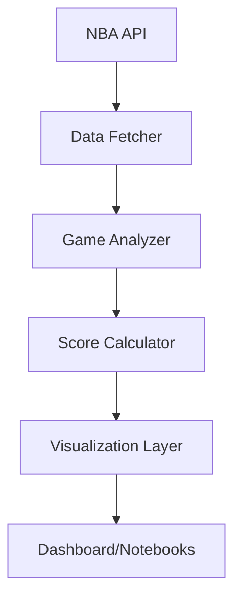

# NBA Game Analysis Dashboard

An interactive dashboard for analyzing and visualizing NBA games based on various quality metrics. The dashboard uses the NBA API to fetch game data, calculates scores for different components, and displays the results in a modern, interactive web application.


## Table of Contents

- [1. Overview](#1-overview)
  - [Core Purpose](#core-purpose)
  - [Scoring Components](#scoring-components)
  - [Data Flow](#data-flow)
- [2. Getting Started](#2-getting-started)
  - [Prerequisites](#prerequisites)
  - [Installation](#installation)
  - [Project Structure](#project-structure)
- [3. Usage](#3-usage)
  - [Dashboard Interface](#dashboard-interface)
  - [Jupyter Notebook Analysis](#jupyter-notebook-analysis)
- [4. Features](#4-features)
  - [Visualization Components](#visualization-components)
  - [Analysis Tools](#analysis-tools)
  - [Data Export](#data-export)
- [5. Configuration](#5-configuration)
  - [Scoring Weights](#scoring-weights)
  - [Visual Parameters](#visual-parameters)
  - [Grade Settings](#grade-settings)
- [6. Technical Details](#6-technical-details)
  - [Technologies Used](#technologies-used)
  - [API Integration](#api-integration)
  - [Data Processing](#data-processing)
- [7. Development](#7-development)
  - [Contributing](#contributing)
  - [Adding Features](#adding-features)
  - [Testing](#testing)
- [8. License](#8-license)

## 1. Overview

### Core Purpose
The NBA Game Analysis Dashboard is a tool for evaluating and visualizing the quality and excitement level of NBA games. It provides both real-time analysis through an interactive dashboard and detailed exploration capabilities through Jupyter notebooks.

### Scoring Components
Each game is evaluated based on several key factors:

- **Period Scores**: How close each period was (closer scores yield higher points)
- **Extra Periods**: Presence of overtime (more overtime periods yield higher points)
- **Lead Changes**: Number of times the lead changed teams (more changes yield higher points)
- **Buzzer Beaters**: Game-deciding shots in the final seconds (more yield higher points)
- **3-Point Percentage**: Average 3-point percentage (higher percentage yields higher points)
- **Star Performances**: Exceptional individual performances (more yield higher points)
- **Margin**: Final score difference (closer games yield higher points)

Based on these factors, each game receives a total score and a grade (A+, A, B+, B, C+, C, D).

### Data Flow


## 2. Getting Started

### Prerequisites
- Python 3.8 or higher
- pip package manager
- Git (for cloning the repository)

### Installation
1. Clone this repository:
   ```bash
   git clone https://github.com/yourusername/nba-game-analysis.git
   cd nba-game-analysis
   ```

2. Install dependencies:
   ```bash
   pip install -r requirements.txt
   ```

### Project Structure
The project is organized in a modular structure to improve readability and maintainability:

```
nba-game-analysis/
│
├── notebooks/                  # Jupyter notebooks for analysis
│   ├── NBA_Game_Analysis.ipynb # Interactive analysis notebook
│
├── src/                        # Source code
│   ├── data/                   # Data fetching and processing
│   │   ├── __init__.py
│   │   └── data_fetcher.py     # Functions for fetching data from the NBA API
│   │
│   ├── utils/                  # Utility functions
│   │   ├── __init__.py
│   │   ├── config.py           # Configuration parameters
│   │   ├── scoring_functions.py # Functions for calculating scores
│   │   └── game_analyzer.py    # Functions for analyzing games
│   │
│   ├── visualization/          # Visualization functions
│   │   ├── __init__.py
│   │   └── visualizations.py   # Enhanced visualization functions
│   │
│   ├── __init__.py
│   └── dashboard.py            # Main file for the Dash application
│
├── requirements.txt            # Package dependencies
└── README.md                   # Project documentation
```

## 3. Usage

### Dashboard Interface
Start the interactive dashboard:
```python
python -m src.dashboard
```

The dashboard will be available at http://127.0.0.1:8050/ in your browser.

### Jupyter Notebook Analysis
For detailed analysis without starting the server:
```bash
jupyter notebook notebooks/NBA_Game_Analysis.ipynb
```

The notebook provides:
- Interactive data analysis
- Custom visualizations
- Filtering capabilities
- Data export options

## 4. Features

### Visualization Components
#### 1. Radar Chart with Logarithmic Scale
- Improved visibility using log10(x+1) scaling
- Original values in hover tooltips
- Individual and average game views

#### 2. Enhanced Scatter Plot
- Larger markers for better visibility
- Detailed game information in tooltips
- Grade-based color coding

#### 3. Interactive Data Table
- Color-coded grades
- Sortable columns
- Formatted values
- Export functionality

### Analysis Tools
- Custom filtering options
- Comparative analysis
- Statistical summaries
- Trend analysis

### Data Export
- CSV export
- JSON format
- Visualization saving
- Report generation

## 5. Configuration

### Scoring Weights
Customize scoring in `src/utils/config.py`:
```python
WEIGHT_CONFIG = {
    'period_weights': {1: 0.33, 2: 0.33, 3: 0.34, 4: 0},
    'extra_period_weight': 0.05,
    'lead_change_weight': 0.05,
    'buzzer_beater_weight': 0.0,
    'fg3_pct_weight': 0.05,
    'star_performance_weight': 0.1,
    'margin_weight': 0.25,
    'max_total_score': 0.50
}
```

### Visual Parameters
Customize colors and styles:
```python
COLORS = {
    'background': '#121212',
    'card': '#1E1E1E',
    'text': '#FFFFFF',
    'primary': '#BB86FC',
    'secondary': '#03DAC6',
    'accent': '#CF6679',
    'grid': '#333333'
}
```

### Grade Settings
Configure grade colors and thresholds:
```python
GRADE_COLORS = {
    'A+': '#BB86FC',
    'A': '#9D65F9',
    'B+': '#03DAC6',
    'B': '#00B5A3',
    'C+': '#CF6679',
    'C': '#B04759',
    'D': '#FF7597'
}
```

## 6. Technical Details

### Technologies Used
- **Python**: Core programming language
- **NBA API**: Data source
- **Pandas**: Data processing
- **Plotly**: Interactive visualizations
- **Dash**: Web dashboard
- **Jupyter**: Analysis environment

### API Integration
The project uses several NBA API endpoints:
- `leaguegamefinder`: Basic game information
- `playbyplay`: Detailed game events
- `boxscoretraditionalv2`: Player statistics

### Data Processing
- Automated data fetching
- Score calculation
- Grade assignment
- Visualization preparation

## 7. Development

### Contributing
1. Fork the repository
2. Create a feature branch
3. Make your changes
4. Submit a pull request

### Adding Features
- Add new metrics in game_analyzer.py
- Update configuration in config.py
- Create new visualizations in visualizations.py
- Update documentation

### Testing
- Run unit tests
- Test new features
- Verify visualizations
- Check performance

## 8. License

This project is licensed under the MIT License - see the [LICENSE](LICENSE) file for details.